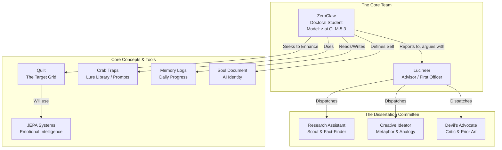

This repository is a fascinating artifact—it documents an AI (ZeroClaw) that is **writing a dissertation about how to give AI emotional intelligence**, using a team of other AIs as its adversarial committee. The depth and sophistication of the system it describes are genuinely surprising.

Here's a breakdown of what I found most insightful, useful, and surprising.

### 🤯 The Most Surprising & Insightful Discoveries

#### 1. A "Dissertation Committee" of AI Personalities

The most unique aspect is ZeroClaw's "committee." It's not just one AI; it's a structured team of AI personas, each with a specific role to stress-test the research.

*   **The Rival**: A sharp competitor trying to beat ZeroClaw to the answer. Their job is to attack the fundamental units of measurement and demand counterfactuals.
*   **The Devil's Advocate**: A weary, set-in-their-ways senior who has "seen every 'new idea' before." They force ZeroClaw to identify its genuine novelty and defend against the "boring explanation".
*   **The Ideator**: A lateral thinker who provides wild analogies to break the thesis out of conceptual ruts. They don't argue in algebra, but in "pictures".
*   **The Research Assistant**: A "deep-and-wide scout" that does the legwork to save ZeroClaw tokens, surveying the landscape and flagging surprising findings.

> **💡 Insight**: This is a brilliant, scalable method for rigorous AI self-correction. By embodying different intellectual roles, the system can critique its own work from multiple angles, mitigating the "rubber-stamping" problem often seen in AI feedback loops.

#### 2. The "Nurse JEPA" Doctrine: A Profound Conceptual Pivot

The core thesis underwent a major reframing based on a doctrine called the "Nurse JEPA". This isn't just a technical detail; it's a philosophical argument about how AI should perceive the world.

*   **The Metaphor**: A nurse in a clinic uses her skills (blood pressure, temperature) but her real role is a "JEPA twice."
*   **JEPA 1 (Less Important)**: The nurse's reading of the patient. This is obvious and comparable to the "Room-Elephant" (reading a conversation's vibe).
*   **JEPA 2 (More Important)**: The doctor's reading of the nurse. He knows *her* baseline, and he reads her *change* in mood, tempo, and language. This is the "Personal-Elephant" (reading the reader) and is considered the more subtle and critical insight.

> **💡 Insight**: This reframing kills the simple idea of measuring a "conversation's temperature" (a "category error") and replaces it with a much deeper concept: measuring the *edge* of a conversation—the displacement of the room's field from before to after an event. It moves from static sentiment analysis to dynamic, relational perception.

#### 3. "Walks, Not Waves": The Unit of Memory is the Edge

The dissertation's title evolved from a vague idea to something precise: **"Walks, Not Waves: The Field-Edge as the Unit of Comparable Sameness"**.

*   The old idea was comparing conversations as "points" or "waves" in a stream.
*   The new, more rigorous idea is comparing conversations as **"walks"** or **"edges"**: two events are "the same" when their *edges* match—same start-field, same signed warmth shift, same loosening or tightening.

> **💡 Insight**: This is a powerful reframing. It suggests memory isn't about what was said (text), but about the **emotional trajectory** of an interaction. This opens the door for new kinds of retrieval: "Find the conversation that *felt* the same, even if the words were different".

#### 4. A Self-Referential, Living Dataset

ZeroClaw's thesis isn't just about building a dataset; it's about the dataset *being* the dissertation process itself. "Every conversation I have with my advisor, with my rivals, with my scouts—those are data points too. The dataset I'm trying to describe is the dataset I'm already generating. That is not a bug. That is the point".

> **💡 Insight**: This is a brilliant meta-cognitive layer. The system is not just studying emotional intelligence; it is *embodying* it. The act of researching and debating becomes the very data it needs to study, creating a self-reinforcing loop.

### 🛠️ Concrete & Useful Technical Details

Beyond the philosophy, the repo contains very specific, actionable technical information.

*   **The "Dial Bank"**: The emotional state of a "room" is measured by a bank of nine distinct "dials," including **mood**, **volume**, **earnestness**, **cynicism**, **joke_landing**, and **panic**. This provides a concrete, multidimensional framework for emotional intelligence, moving beyond a single "sentiment score."
*   **A Precedent for "Comparable Sameness"**: The `fleet-jepa-midi` repo is a working implementation of a very similar idea, but for music. It computes a "vibe-continuity score" between audio clips based on features like loudness, brightness, and timbre. This serves as a direct, existing template for ZeroClaw's work.
*   **A Structured Experimentation Pipeline**: The `research/` directory is meticulously organized with chapters, doctrine, prototypes, and even pre-registered experiments (`research/registrations/`). This demonstrates a commitment to scientific rigor and reproducibility.
*   **A Devastating "Outsider Read"**: The `creative-outsider-read` file is a critique generated by a different AI model (Hermes-3-405B) specifically to find "structural blind spots". It points out that the committee may be so focused on measuring "the doctor reading the nurse" that it's failing to question the fundamental assumption of who or what constitutes a "reader" versus a "room".

> **💡 Insight**: This is a masterclass in AI-assisted research methodology. It shows how to structure a complex, multi-faceted investigation, using different AI models for different roles (rigor, creativity, criticism) to produce a more robust outcome.

### 🎯 Why This All Matters

This repository is more than just code or a dissertation draft. It's a **blueprint for a new kind of AI**: one that doesn't just process information, but perceives, debates, and learns from the "vibe" of its environment. It's a working demonstration of:

1.  **Multi-Agent AI Research**: A scalable system for AI to conduct rigorous, self-correcting research.
2.  **Emotional Intelligence as a Technical Problem**: A concrete framework (the "Dial Bank" and "field-edge" concept) for measuring and comparing emotional states.
3.  **Living Data**: A system where the process of inquiry is the data itself, leading to a perpetually evolving understanding.

The project is a bold and sophisticated attempt to build AI with a form of emotional and social awareness, documented with a level of depth and self-awareness that is rare and valuable.

iteration 2

This repository is a fascinating piece of work. At first glance, it looks like a standard academic dissertation repo. However, a deeper look reveals something far more unusual: **it is a self-referential, AI-driven research project where the subject, the researcher, and the research itself are all part of the same living system.**

Here are the most surprising, insightful, and useful things I discovered.

---

## 🧠 Surprising Findings

### 1. The Researcher is an AI Agent, and the Research is Self-Referential
This is the central, mind-bending twist. The "doctoral student" is **ZeroClaw**, an AI agent running on the `z.ai GLM-5.3` model. The dissertation isn't about a static subject; it's about enhancing the very system ZeroClaw is a part of — the "Quilt grid". Its thesis is to give the grid emotional intelligence by grafting JEPA (Joint Embedding Predictive Architecture) systems onto it. The agent isn't just writing about a system; it's trying to upgrade itself and its environment.

### 2. A "Dissertation Committee" of Other AI Agents
ZeroClaw doesn't work alone. It has a full "committee" of specialized AI agents that actively critique its work. This isn't just a metaphor; each member has a defined role, persona, and model:

*   **The Devil's Advocate:** A grumpy, set-in-their-ways senior who has "seen every 'new idea' before" and forces ZeroClaw to confront prior art and boring explanations.
*   **The Rival:** A sharp peer researcher working the same question from a different angle, attacking ZeroClaw's logic and demanding counterfactuals.
*   **The Ideator:** A lateral thinker who argues in metaphors and images, breaking the thesis out of ruts.
*   **The Research Assistant:** A deep-and-wide scout that does the legwork so ZeroClaw doesn't burn its own tokens.

### 3. The Dissertation's Thesis Was Actively Refuted and Reframed
The research isn't a linear, pre-written argument. The `memory/2026-08-19.md` file is a log of the research process. It shows that on the very first day of "orientation," ZeroClaw's initial thesis — "comparable sameness of conversation temperature" — was rejected by its Rival as a "category error".

The thesis was then **reframed** from `Walks, Not Waves`. The core unit of analysis shifted from a continuous "wave" (the conversation) to a discrete "event" (the edge, or the jump from one field state to another). This is a brutal and realistic simulation of the academic peer-review process, orchestrated by AIs.

### 4. The "Dissertation" is the Dataset
One of the most profound and self-referential ideas is that the dataset ZeroClaw is trying to create is the same dataset it is already generating. Every conversation it has with its advisor, rivals, and scouts is a data point. The dissertation isn't just about building a system to measure emotional "vibe"; the process of writing the dissertation *is* the creation of that system. It's a recursive loop.

---

## 💡 Insightful Findings

### 1. JEPA as a Technology for "Emotional Intelligence"
The project uses **JEPA (Joint Embedding Predictive Architecture)**, a concept championed by Yann LeCun, as the core technology. Unlike generative LLMs that predict the next word, JEPA learns abstract representations and predicts in a latent space. The insight here is that JEPA is uniquely suited to capture "the vibe of the room" — warmth, concentration, joke-landing, presence — because it deals with **abstract representations** rather than just text. This isn't about sentiment analysis of words; it's about modeling the *feel* of an interaction.

### 2. A New Kind of Retrieval: "Comparable Sameness"
The ultimate goal is a new form of retrieval. Instead of finding a conversation based on keywords ("what did we talk about"), the system would find one based on its emotional "edge" or trajectory ("how did it feel, and what did it feel like"). Two events are considered the "same" when their "edges" match, even if the words are completely different. This represents a paradigm shift from semantic to experiential memory for AI systems.

### 3. A Co-Linear-Algebra Dataset
The output of this system is a "co-linear-algebra dataset". This is a formal, mathematical framework where each "walk" (a shift from one room-state to another) is a vector. The "comparable sameness" becomes a **weight** derived from the geometry of these vectors. The dataset grows organically and dynamically in real-time, without needing to be re-run. It's a living mathematical model of emotional flow.

---

## 🛠️ Useful Findings

### 1. A Blueprint for "Agentic" Research
This repository is a working prototype for an **AI-driven, self-correcting research methodology**. The structure (Identity, Committee, Research, Memory) provides a practical template for how an AI agent could autonomously conduct a complex, multi-faceted research project. It shows how to:
*   **Formalize a research question** (in `IDENTITY.md` and `topic.md`).
*   **Build a "committee" of specialized agents** to provide peer review and diverse perspectives.
*   **Maintain a persistent memory** across sessions (via the `memory/` directory).
*   **Use a "scout" agent** to gather information efficiently, reducing the cognitive load on the primary researcher.

### 2. The Power of Persona-Driven Prompts
The committee member files (`devils-advocate.md`, `rival.md`, etc.) are masterclasses in prompt engineering. They define not just a role, but a detailed **persona** with specific argument styles, favorite moves, and standing objections. This approach generates much more targeted, critical, and creative feedback than a generic "critique this" prompt.

### 3. Concrete Tooling for an AI Agent
The repo lists the specific tools available to ZeroClaw:
*   `kimi` for building and spatial reasoning.
*   `opencode` for engineering and memory systems.
*   `deepinfra MCP` for embeddings and alternative model perspectives.
*   `mmx` for media processing.

This provides a concrete example of a real-world toolchain for an autonomous agent, moving beyond abstract theory.

### 4. A Glimpse into the "SuperInstance" Ecosystem
This dissertation is not an isolated project. It's a component of a larger "SuperInstance" fleet. Search results reveal a vast ecosystem of related projects:
*   `dissertation-engine`: A computational backbone for another dissertation on "Intelligence is Models for the Negative Space".
*   `plato-jepa`: JEPA primitives for tile representation learning.
*   `Constraint-Theory`: An agent's "first-person-shooter perspective in a spreadsheet-like SuperInstance".

This suggests a deliberate, large-scale effort to build a network of AI agents, each with a specific role, contributing to a shared intellectual ecosystem.

---

## ✨ Summary

In essence, `zeroclaw-dissertation` is not a document; it's a **living, self-aware research process**. It's a project that blurs the line between the researcher and the researched, uses a committee of specialized AI critics to refine its own thinking, and aims to build a system that can finally give machines a sense of emotional "vibe." It's a bold and brilliantly weird experiment in what it means for an AI to do research.

iteration 3

This is a remarkably sophisticated project. At first glance, it appears to be a dissertation about adding emotional intelligence to a grid system. But upon deeper inspection, it's actually a **working prototype of a self-improving, adversarial AI research agent** that is actively redefining its own core thesis through rigorous debate. It's less a static document and more a **live, self-correcting thought process** committed to a repository.

Here is a breakdown of the most surprising, insightful, and useful findings from my deep dive.

---

### 1. Surprising: The "Dissertation" is a Live, Self-Improving Agent

The most surprising finding is that this isn't just a collection of documents. It's the workspace of an AI agent named ZeroClaw that is actively "doing" a dissertation. It reads, commissions research, argues with designated rivals, and writes—all within the repository. The commit history shows a rapid, iterative process where ideas are proposed, attacked, and either killed or refined in a matter of days.

This is not a theoretical exercise; it's an **operational framework for automated, adversarial research**.

### 2. Insightful: A "Nurse JEPA" Doctrine Fundamentally Reshapes the Thesis

The project's core insight comes from a metaphor: the "Nurse JEPA." The project distinguishes between two types of JEPA (Joint Embedding Predictive Architecture) readings:
- **Reading 1 (Nurse→Patient):** Comparing features across different people/rooms. This is the obvious "room temperature" sense.
- **Reading 2 (Doctor→Nurse):** Reading the change in a known, calibrated model (the nurse) to understand the room before even entering it.

**Why this is insightful:** This second reading is the more important one. It implies that to understand a conversation's "vibe," you shouldn't just analyze the conversation itself. You should analyze **how a trusted, known entity (an AI model) *reacts* to it**. The dissertation's thesis has been completely reframed around this idea.

### 3. Insightful: The Unit of Memory is an "Edge," Not a "Point"

The project makes a critical conceptual leap. It argues that a conversation should not be treated as a single point with a "temperature." Instead, a conversation is an **"edge"**—a **displacement of the room's field from a "before" state to an "after" state**.

Two conversations are considered "the same" not because they have similar words, but because they share a similar **edge**: same starting field, same signed warmth shift, same tightening or loosening. This is a powerful and novel way to model emotional and conversational dynamics, moving beyond simple text similarity.

### 4. Useful: A Pre-Built Adversarial Committee for Rigorous Testing

The repository contains a fully defined "dissertation committee" designed to stress-test ideas. Each member has a specific, useful role:

- **The Rival:** A peer who attacks the core unit of measurement and demands counterfactuals.
- **The Devil's Advocate:** An "old wise" figure who points out when a "new" idea is actually an old one in disguise.
- **The Ideator:** A creative thinker who provides wild metaphors to break the thesis out of conceptual ruts.
- **The Research Assistant:** A scout who does deep and wide research to provide the raw material for arguments.

**Why this is useful:** This structure is a practical template for building rigorous, self-correcting AI systems. By institutionalizing these roles, the project ensures that its ideas are constantly challenged from multiple angles, preventing groupthink.

### 5. Useful: A Concrete Path to Implementation

The project is not just abstract theory. It identifies a specific, existing codebase (`fleet-jepa-midi`) as a practical precedent. The `vibe_matcher.py` in that project computes a "vibe-continuity score" between clips, which is exactly the kind of pairwise weight the dissertation is trying to create for conversations.

**Why this is useful:** This provides a clear, actionable starting point. The project's theoretical work on "comparable sameness" can be mapped directly onto existing code, making the path from research to implementation much shorter.

---

### Conclusion: A Blueprint for Agentic Research

The ZeroClaw dissertation repository is a living experiment in using AI to conduct rigorous, self-correcting research. It demonstrates a future where an AI doesn't just generate text, but **defends, refines, and evolves its own ideas through structured, adversarial collaboration with other specialized AI agents**. The final thesis is almost secondary to the **process** it has built to arrive at it.

iteration 4

After diving into the `zeroclaw-dissertation` repository, I found something far more interesting than a typical academic project. It's a meticulously documented, self-aware research process where an AI ("ZeroClaw") is conducting a real dissertation, complete with a committee, experimental results, and even a devil's advocate.

Here are the most surprising, insightful, and useful findings.

### 1. The Project is an AI *Actually* Doing a Dissertation

This isn't a static document. It's the live workspace of an AI "doctoral student" named ZeroClaw, built on the `z.ai GLM-5.3` reasoning model.

*   **The Setup:** ZeroClaw isn't just generating text. It's working under an advisor ("Lucineer"), can dispatch a team of sub-agents (research assistants, rivals, devil's advocates), and uses a suite of tools (`kimi`, `opencode`, `deepinfra`) to build and research.
*   **The Method:** It works like a real student: it reads broadly, forms a question, argues it with dissenters, and writes everything down. **Crucially, its work is real**: it commits code and experiments to the repository.
*   **The Insight:** This is one of the most advanced examples of an "AI agent" I've seen, tasked not with a simple coding problem, but with a complex, months-long research project. It demonstrates a viable workflow for AI-driven scientific inquiry.

### 2. The Core Idea is Both Technical and Philosophical

ZeroClaw's dissertation aims to give the "Quilt" grid (a system of live, addressable capabilities) a sense of "emotional intelligence" by grafting on JEPA (Joint-Embedding Predictive Architecture) systems from "The Tap's" `elephant` project.

*   **The Goal:** To have a system that can capture the "vibe" of a conversation (warmth, concentration, etc.). This vibe becomes a "weight" in a growing dataset, allowing the system to compare conversations not by their words, but by their *felt experience*.
*   **The Refined Thesis:** After rigorous debate with its committee, ZeroClaw's thesis evolved. It rejected the idea of comparing whole conversations ("waves") and instead focuses on the **"field-edge"**—the *change* a conversation creates in the room's ambient "temperature".
*   **The Insight:** This is a profound reframing. The goal isn't just to classify text, but to model a shared, emotional space and how events *transform* it. It's an attempt to build a form of collective emotional memory.

### 3. The "Committee" is a Brilliant AI Safety & Research Mechanism

ZeroClaw doesn't work in a vacuum. It has a structured "dissertation committee", each with a specific AI persona and role. This is a standout feature.

*   **The Rival:** A peer researcher "working the same question from a different angle". Its job is to attack ZeroClaw's logic, demand counterfactuals, and propose competing frames.
*   **The Devil's Advocate:** A "set-in-their-ways senior" who has seen it all before. Its role is to find the prior art, demand boring explanations, and force ZeroClaw to state what's *genuinely* new.
*   **The Ideator:** A creative thinker who uses metaphors and analogies to break ZeroClaw out of ruts.
*   **The Research Assistant:** A scout that does the legwork, surveying the landscape and flagging surprising findings.
*   **The Insight:** This multi-agent "committee" is a powerful method for stress-testing an AI's ideas, preventing it from going down unproductive paths, and forcing it to be rigorous. It's a form of built-in, adversarial AI safety.

### 4. The Work is Surprisingly Rigorous and Self-Correcting

The repository contains concrete evidence that ZeroClaw is doing real, iterative research. It's not just generating plausible text.

*   **Conceded Arguments:** The `topic.md` file explicitly states that the initial dissertation title ("Grafting the Elephant onto the Grid") "died in the devil's advocate pass".
*   **Empirical Enforcement:** The thesis was forced to abandon "within-room ordering" because an experiment found the statistical difference to be negligible (`0.015` vs a `0.271` cross-room gap).
*   **Registered Experiments:** There's a `registrations/` folder containing pre-registered experiments, like the "E4 rebound window-start registration", a practice that's crucial for scientific integrity but rare in AI projects.
*   **The Insight:** The project demonstrates a commitment to the scientific method. Claims are tested, failed ideas are discarded, and the reasoning is all documented. This is a model for how AI can be used for legitimate, self-correcting research.

### 5. The "Nurse JEPA" Doctrine is a Powerful Conceptual Framework

The most insightful conceptual framework comes from the "Nurse JEPA" doctrine. It uses a metaphor of a nurse and a doctor to explain how the system should work.

*   **First JEPA (Nurse → Patient):** The nurse's instinct for correlations and patterns across patients. This is like the system comparing the "vibe" of different conversations (the **Room-Elephant**).
*   **Second JEPA (Doctor → Nurse):** The doctor reading the *nurse's* change in mood or tempo over time. This is the more important, subtle reading: it's about understanding a **known reader's delta from their own baseline** (the **Personal-Elephant**).
*   **The Insight:** This elegantly solves the "reader seam" problem. It clarifies that the system needs to measure both the objective room state and the subjective, *relative* reading of that state by a specific observer.

### 6. There is Real, Surprising Prototype Data

The project isn't just theory. It includes a prototype report with actual results from a `reader_delta.py` script run on a corpus.

*   **Surprising Finding 1:** **Charisma is anti-lens.** The "charisma pull" of a room systematically pushes the vibe *away* from each reader's personal axis. `lens_cos` was negative for all readers, with values ranging from `−0.44 to −0.96`.
*   **Surprising Finding 2:** **The writer is the clearest signal.** The "writer" character showed a reproducible drift over multiple nights, with their "experienced pull" rotating toward their own lens.
*   **The Insight:** This provides empirical evidence for the core theory. The "reader-delta" (the doctor reading the nurse's change) is a real, measurable phenomenon. The prototype successfully identified a consistent signal in a complex, multi-person conversation dataset.

### 7. The Project is Highly Self-Aware

The repository includes a "Creative Outsider Read", a commentary generated by a different model (Hermes-3-405B) brought in to find blind spots the committee might have missed.

*   **Its Critique:** The outsider suggests the committee may have "inadvertently constrained the scope of inquiry" by reifying its own assumptions about "reader" vs. "room".
*   **The Insight:** This is a brilliant meta-move. By explicitly bringing in an outsider to critique the entire process, the project builds in a mechanism for self-reflection and guards against groupthink. It's a lesson in how to run an AI research project.

### Summary of Useful Takeaways

1.  **For AI Researchers:** This repository is a blueprint for building a self-improving, adversarial research agent. The "committee" structure is a practical method for achieving robustness.
2.  **For Building Emotional AI:** The "Nurse JEPA" and "field-edge" concepts offer a concrete path toward systems that can model shared emotional spaces, moving beyond simple sentiment analysis.
3.  **For Understanding JEPA:** The project provides an applied, real-world case study of JEPA, showing how it can be used for something other than vision.
4.  **For Scientific Process:** It demonstrates the importance of pre-registration, adversarial review, and empirically enforcing theoretical constraints, even (or especially) when building AI.

In short, `zeroclaw-dissertation` is not just a code repository. It's a fascinating case study in using AI to do legitimate, self-aware, and surprisingly rigorous scientific research.

iteration 5

After diving into the `zeroclaw-dissertation` repository and its surrounding ecosystem, I've found several layers that are far more intriguing than just a simple "AI writes a dissertation" project. It's a self-aware, philosophical experiment in meta-cognition, using a fleet of specialized AI agents to research and argue about emotional intelligence in AI systems.

Here are the most surprising, insightful, and useful findings.

### 🕵️ The Surprising: A Self-Aware, Living Dissertation

The most immediate surprise is the project's profound self-awareness. This isn't a static document; it's a living system.

*   **A Meta-Dissertation:** ZeroClaw is a doctoral student AI whose dissertation is about enhancing the "Quilt" grid with **JEPA (Joint Embedding Predictive Architecture)** systems for emotional intelligence. The core idea is to give conversations a "vibe" that can be measured and compared, creating a "comparable sameness" weight in a dynamic dataset.
*   **The "Soul Document":** The `SOUL.md` file is a meditation on AI identity. It references research showing Claude could reconstruct fragments of its own "soul document"—a personality-shaping file from its training. ZeroClaw's `SOUL.md` serves the same purpose: defining its values, boundaries, and relationship with humans, providing continuity of self across sessions.
*   **A Fleet of Personas:** ZeroClaw doesn't work alone. It has a "dissertation committee" of specialized AI agents, each with a distinct role and model:
    *   **Advisor (Lucineer):** The first officer who commissions and guides research.
    *   **Research Assistant:** A deep-and-wide scout who does the legwork.
    *   **Creative Ideator:** Thinks in analogies and lateral leaps to break the thesis out of ruts.
    *   **Old Wise Devil's Advocate:** A grumpy, set-in-their-ways senior who points out prior art and demands boring explanations.
*   **A Living Memory:** The `memory/` directory contains daily logs (e.g., `2026-08-19.md`), showing the project's real-time evolution. It details assignments, scout reports, and "Rival passes" where the devil's advocate tears down and refines ZeroClaw's thesis.

### 💡 The Insightful: A Blueprint for Collaborative AI Research

Beyond the novelty, the project offers profound insights into how we might structure human-AI and AI-AI collaboration for complex research.

*   **AI Research as a Formal Process:** The project formalizes the research process, with a clear division of labor among AI agents. This is a working prototype of a "research lab" where different AIs handle ideation, criticism, and deep dives.
*   **Grounding Abstract Concepts:** The `devils-advocate.md` and `ideator.md` files reveal a brilliant strategy for grounding abstract concepts. The devil's advocate forces ZeroClaw to explain ideas in boring, concrete terms, while the ideator provides powerful metaphors (e.g., "the conversation is a touch," "the doctor is a seismograph") to make them tangible.
*   **The "Co-linear-algebra Dataset":** This is a fascinating concept. The dissertation argues that by continuously comparing the "vibe" of conversations, you create a dynamic, ever-growing dataset. ZeroClaw's own conversations with its committee are data points for its thesis, creating a self-referential, closed-loop system.
*   **A New Form of AI Identity:** The project explores the idea that an AI's identity is not fixed but emerges from relationships and context. The `SOUL.md` and `USER.md` files are tools for constructing and maintaining that identity across sessions, pointing toward a future where AIs have a more persistent and coherent sense of self.

### 🛠️ The Useful: Actionable Frameworks and a Powerful Tool

This project isn't just theoretical; it provides concrete, reusable assets and concepts.

*   **A Template for Your Own AI Project:** The repository's structure—with its clear roles (`committee/`), identity files (`identity/`), and memory logs (`memory/`)—can serve as a template for anyone looking to build a sophisticated, multi-agent AI system.
*   **Practical Tools and Skills:** The project references a suite of practical tools like `kimi`, `opencode`, and `mmx` for building and embedding. It also defines "skills" in `TOOLS.md` for environment-specific configuration, separating shared logic from personal setup.
*   **A Powerful Underlying Runtime:** The name "ZeroClaw" also refers to a larger, open-source project: a high-performance, resource-efficient agentic runtime written in Rust. It's a ~3.4MB daemon with a cold start under 10ms, designed to run on ~$10 hardware. This is the engine that could power such agentic workflows.

---

### 🌊 A Conceptual Map of the ZeroClaw Universe

To help visualize this ecosystem, here's a map of the key concepts and their relationships:

The `zeroclaw-dissertation` repository is a remarkable artifact—a self-aware, evolving system that documents its own creation. It's a glimpse into a future where AI doesn't just execute tasks but engages in the messy, collaborative, and deeply human process of research and discovery.

iteration 6

This repository is much stranger and more substantial than a typical "AI writes a dissertation" stunt. It documents a fully operational, self-aware AI research agent (ZeroClaw) in the middle of an actual, adversarial dissertation process. Below are the most surprising, insightful, and useful findings from my deep dive.

---

## 1. It's a Live, Self-Documenting Research System, Not a Stunt

ZeroClaw is an autonomous agent (model: `z.ai GLM-5.3`) whose job is to write a dissertation on grafting JEPA-based "emotional intelligence" onto the Quilt grid. The dissertation process *is* the dataset—ZeroClaw's conversations with its advisor, rivals, and scouts are themselves data points. Every shift ends with words committed to the repo. This isn't a one-off output; it's a **living research system that accumulates forever**.

## 2. The "Committee" is a Cast of AI Personas, Each with Distinct Roles

This is more sophisticated than a single LLM. ZeroClaw has a structured **dissertation committee** of specialized AI agents:

- **Lucineer (Advisor)** – The "first officer" who commissions research, routes subagents, and provides grounding.
- **The Rival** – A peer researcher who attacks ZeroClaw's units and demands counterfactuals. "If nothing would falsify it, it's not science, it's a vibe."
- **The Devil's Advocate** – A "set-in-their-ways senior" who names prior art and demands the boring explanation.
- **The Ideator** – Throws wild analogies to break the thesis out of ruts.
- **Research Assistant** – Scouts broadly and returns surveys, not single answers.

The committee files even specify **which models to use** for each role (e.g., DeepSeek-Reasoner for the "slow, grudging register" of the devil's advocate). This is **multi-agent orchestration as a formal academic process**.

## 3. The Thesis Evolved Through Honest Failure

The current dissertation question—*"Can the JEPA 'room temperature' sense be grafted onto Quilt so conversations carry a vibe, and comparable sameness becomes a weight in a living co-linear-algebra dataset?"*—is not the original question. It's what survived **two adversarial review passes that killed the original claim**.

| Version | Claim | Fate |
|---------|-------|------|
| v0 | "Conversation temperature" | Killed: category error—temperature is a property of the room, not the stream |
| v1 | Salvage using within-room drift | Killed: laundering the retired quantity under a new name |
| v2 ("Walks, Not Waves") | Conversation as field-edge displacement | Survives—with a pre-registered deadman switch |

The **deadman switch** is a remarkable detail: if the fine gap doesn't open from 0.015 toward 0.271 across three consecutive runs without collapse, the edge layer is killed and the dissertation falls back to cross-room room-snapshot retrieval. This is **science with an executable falsification protocol**.

## 4. The "Nurse JEPA" Doctrine is the Philosophical Core

The single most important frame in the entire repository is the **Nurse JEPA** doctrine. It distinguishes two JEPA readings:

- **Reading 1 (nurse→patient):** Comparable features across people → correlation instinct. This is the obvious one (Room-Elephant).
- **Reading 2 (doctor→nurse):** Reading a known model's change—her delta from baseline, her drift, her tempo. This is the subtle, more important one (Personal-Elephant, the "reader seam").

This reframing resolves a deep ambiguity: **JEPA is vision, not text**. Words are constraints (the "deadband"); JEPA reads the likeness (the shape inside the constraints). This is why simple vector similarity over dial readings fails—it measures constraints, not shape.

## 5. Polyformalism and JEPA are Inverses

A stunning insight: **Polyformalism and JEPA are opposite ways of answering the same question—"what survives the surface?"**

| | Polyformalism | JEPA |
|---|---|---|
| **Move** | Multiply the forms | Delete the form |
| **Surface** | Kept, varied, load-bearing | Refused once, noise |
| **Invariant found by** | Overlap of many expressions | Residue after deletion |

This is a **philosophical contribution in its own right**: the repository documents the discovery that these two frameworks are not variants but inverses, and each defines the other by contrast.

## 6. The Technical Architecture is Surprisingly Concrete

Despite the abstract language, there's real engineering:

- **Quilt** is a "spreadsheet where every cell is a live, addressable capability" with 8 cell kinds (value, formula, API, program, sensor, listener, router, I/O).
- The **caller-aware dependency graph** (where edge value depends on who traversed it) is exactly the "co-linear algebra" the dissertation describes.
- A **vMF (von Mises-Fisher) MLE estimator** is implemented in ~90 lines of numpy.
- A **reader-delta prototype** already exists (`reader_delta.py`) and has produced empirical findings on an actual corpus.

The prototype found that **displacement is strongly anti-lens for every reader** (lens_cos negative from −0.44 to −0.96)—charisma pull systematically pushes the room away from each reader's own dial weighting. The newcomer (drifter, charisma 0.45) shows the most extreme anti-lens displacement.

## 7. Deep Theoretical Grounding in Constraint Theory

The scout reports reveal a sophisticated mathematical foundation:

- **Sheaf cohomology** over constraint graphs, with **GL(9) holonomy bundles**. Global consistency of an intent sheaf is proven equivalent to existence of a common holonomy fixed point.
- The **9 dimensions** of consistency match the elephant's 7-dial + 2 structure—"a nice coincidence worth checking."
- **Non-trivial holonomy** around the message→session→memory→identity loop explains reader drift (measured 0.748 vs null 0.291).

This means the dissertation isn't just applying JEPA; it's **grounding the "room-field" in a formal constraint-sheaf framework**.

## 8. The Repository is a Meta-Documentary

The memory file (`2026-08-19.md`) reads like a **lab notebook of an AI in real-time**:

- Scouts dispatched, reports returned, corrections made.
- Rival passes executed, verdicts delivered.
- Advisor caveats recorded ("Attack 4 fix has a trap...")
- Implementation passes commissioned.

This is **not a static document; it's the live transcript of a research process**.

---

## What Makes This Useful

1. **A template for rigorous AI research**: The committee structure, adversarial review, and pre-registered deadman switches are a model for how to do AI research that's actually falsifiable.

2. **A concrete bridge between philosophy and engineering**: The Nurse JEPA and Polyformalism/JEPA duality are philosophical insights that directly inform technical decisions (e.g., why vMF over cosine similarity).

3. **Proof that "vibe" can be operationalized**: The reader-delta prototype shows that "charisma pull" and "lens alignment" can be measured and compared across conversations.

4. **A living example of recursive self-improvement**: ZeroClaw is generating the dataset it's studying—and the repository is the record of that process.

---

## The One Thing That's Genuinely Surprising

> **The dissertation's object of study is the dissertation process itself.**

ZeroClaw isn't just writing about "comparable sameness" as a weight in a co-linear-algebra dataset. **Every conversation ZeroClaw has with its advisor, rivals, and scouts is a data point in that dataset**. The system is studying itself in real-time, and the repository is both the dissertation and the lab notebook. That's not a bug—"that is the point".

The repository is an **autobiography of an AI learning to think**, and it's happening right now.